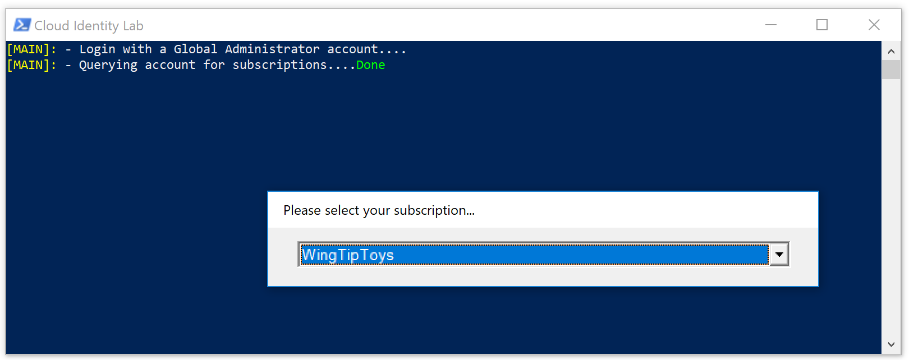
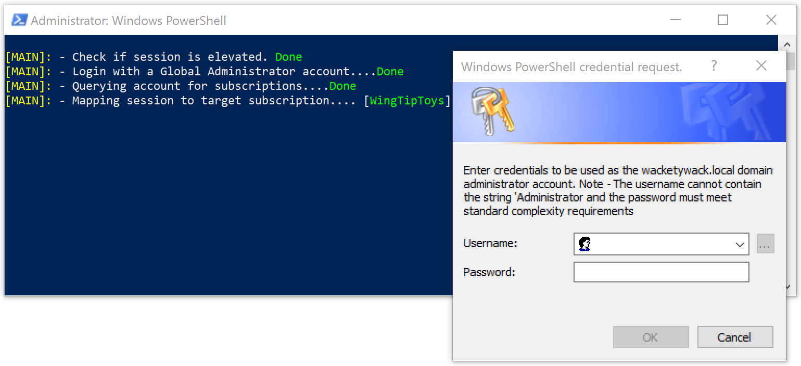
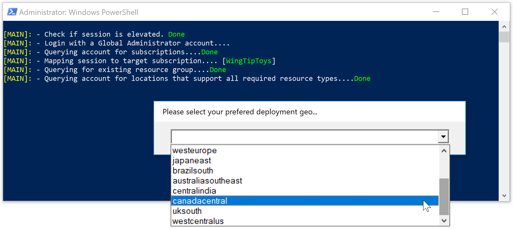
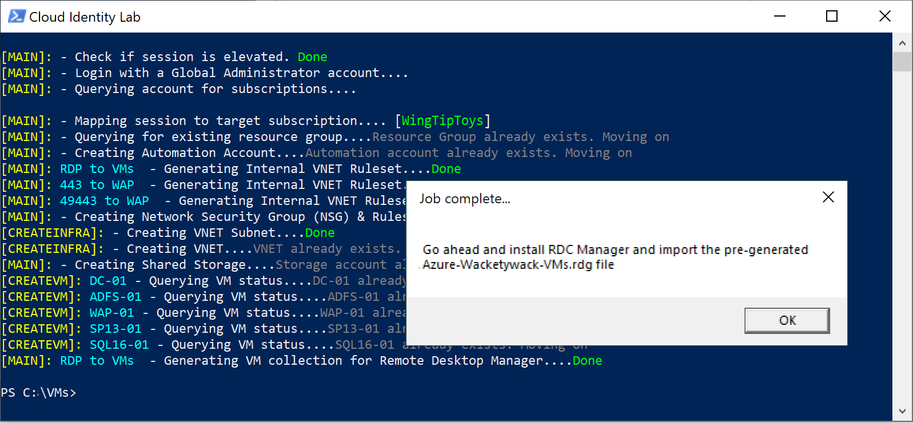

# Cloud Identity Lab
Smart provisioning of an entire lab comprising of a DC, ADFS, WAP, MFA, RDS, MIM, and APP VMs, into Azure RM...

Script will also check for prescence of Remote Desktop Manager, and download if necessary, plus auto generate an 
RDP collection file for all VMs in enviroment...

